Impala is built for **async inference**: model calls where no human is reading tokens as they arrive.

Background coding agents. Research agents working through a question. Multi-step automations. Enrichment pipelines. Evaluation sweeps. Classification across a corpus.

This work still has deadlines. The deadline is on the **task**, not on the token. A research agent that takes four minutes is fine. Paying interactive prices for those four minutes is not.

## What this changes for you

Four things to do differently, before anything else on this page:

- **Raise your timeouts.** SDK defaults are tuned for interactive providers and will abort early. Expect seconds rather than milliseconds, and longer under load.
- **Turn off automatic retries.** Retrying a queued request adds load without shortening the wait.
- **Benchmark a whole task, not a single request.** One request tells you almost nothing about how the workload will perform.
- **Count your turns.** For an agent, total time is per-step time multiplied by the number of steps — so turn count is usually a bigger lever than any individual call.

## Where the time goes

```mermaid
gantt
    dateFormat X
    axisFormat %s
    section Interactive
    Prefill                          :0, 1
    Decode — a person reads each token :1, 6
    section Async agent task
    Step 1                           :0, 4
    Tool call                        :4, 5
    Step 2                           :5, 9
    Tool call                        :9, 10
    Step 3                           :10, 14
```

The interactive request is short and every millisecond of it is experienced. The async task is longer and none of it is. Shortening the interactive bar improves a product; shortening the async bar mostly means running fewer steps.

## The metric is tasks per dollar

For async work the economic question is: for a fixed budget, how many tasks finish?

That's **tasks per dollar** — cost per completed task. Its fleet-side counterpart is **throughput**: how fast the cluster turns work out at scale. The wall-clock number that matters is **task completion time**, from submitting a task to holding the finished result.

Notably absent: time to first token.

## How this differs from interactive inference

Interactive AI puts a person in the loop reading output as it streams — chat, copilots, autocomplete. There, the experience *is* the latency, so the system is measured by interactivity SLOs and has to keep capacity **ready** rather than busy. Idle headroom is the product.

| | Interactive | Async |
| --- | --- | --- |
| Who's waiting | A person, per token | Nothing, until the task is done |
| Measured by | TTFT, TPOT, ITL | Tasks per dollar, task completion time |
| Capacity is | Held ready | Kept busy |

Bring interactive instincts to async work and you'll optimize the wrong number — benchmarking time to first token, tuning a p99 nobody experiences, paying for idle headroom that serves an SLO your workload doesn't have.

## Why throughput sets the price

A GPU costs the same per hour saturated or idle. What changes is how many tokens come out of it — which makes cost per token a throughput problem, and the arithmetic lopsided: double throughput on the same hardware and cost per million tokens falls by roughly half, while halving your electricity price moves it about five percent.

So Impala runs hot instead of holding capacity in reserve. Keeping GPUs saturated means the scheduler is always packing work, and a request arriving into a busy, well-packed fleet waits longer than one arriving into an idle machine held ready for it. That wait is the price of the utilization that produces the cost per token. For async work it's paid in a currency you don't spend.

The full argument, with the numbers, is in [Run It Hot](https://www.getimpala.ai/blog/run-it-hot).

## Where the throughput comes from

**Continuous batching** — requests join and leave a running batch instead of waiting for a batch boundary, so the GPU rarely runs a partial workload.

**Prefix reuse** — agents re-read a large shared prefix every step: system prompt, tool schemas, accumulated history. Caching that KV state and routing steps to workers already holding it removes most of the recomputation.

**Dynamic scheduling** — routing and memory placement are decided continuously against live fleet signals rather than fixed at deploy time.

**Tiered memory** — KV state moves between faster and slower tiers instead of pinning everything to the most expensive memory.

None of this is yours to configure. It's the reason the cost per token looks the way it does.

## The trade, stated plainly

Impala gives up per-request latency guarantees and gets throughput and cost per token in return. For work with a person reading the output, that's a bad trade. For everything else, it's the point.

<Info>
  Async is not a synonym for batch. An agent calling the model in a loop is async work — nobody reads its intermediate tokens — but each call still returns its own response. Both [Batch](/run-your-first-batch) and [single requests](/send-a-request) serve async workloads.
</Info>
